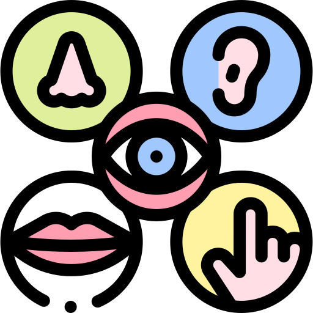

## About Me

<!-- 袁 玫 -->
<!-- Hi! I'm YUAN Mei (袁 玫)!  -->
Hi! I'm YUAN Mei (袁 玫)! 
I am currently a visiting student at <a href="https://www.cmu.edu">Carnegie Mellon University</a>, under <a href="https://scholar.google.com.hk/citations?user=9f4JUrUAAAAJ&hl=en">Prof. XU Min</a>'s guidance, working on agentic multimodal systems and embodied AI for automated science and biomedicine. 

I received my Master's degree in Computational Linguistic Engineering from <a href="https://english.pku.edu.cn">Peking University</a>, where I was fortunately supervised by Prof. LI Boting and worked closely with <a href="https://scholar.google.com.hk/citations?user=9f4JUrUAAAAJ&hl=en">Prof. SU Qi</a>. Before that, I received my Bachelor's degree in Information System.

During my postgraduate studies, 
I interned at Microsoft Research Asia (MSRA), collaborating with <a href="https://chang-xu.github.io/">XU Chang</a>, where I worked on time series reasoning, and at Apple Inc., where I led pilot projects on LLM applications for the sales sector. Additionally, I co-founded <a href="http://textpanda.cn">TextPanda</a>, an intelligent writing platform powered by our Chinese Spelling Check model '**Zous-1B**'.

 

My primary research interest lies in (Multimodal) Large Language Models and their **scientific** and **creative** applications. Specifically:

<!-- -  -->

-  **Scientific discovery automation**.

  Build agentic multimodal systems that monitor industrial and laboratory processes from biochemical synthesis to manufacturing quality control. The intelligent systems are able to perceive multisensory data, analyze complex temporal dynamics, forecast future states, and make autonomous decisions with minimal human intervention. 

-  **AI-supported human learning and digital humanities**.

  Design adaptive tutoring systems with specialized support for human-in-the-loop interactive paradigms to assist education and human learning. Also create unified frameworks for vision-language generation that enable coherent, controllable storytelling and creative content with global context understanding.

-  **Creative and controllable storytelling**.
   
  Generate visual-linguistic intertwined and controllable narratives and illustrations in a unified manner, allowing for interaction with users on a self-built dynamic storyboard.

-  **Unified MLLMs for Comprehension and Creation**.
  
  Learn both language and vision posteriors simultaneously and generate free-form interleaved content.

 

My email is yuanapr97 [at] gmail [dot] com.  

 

****

## Publications

1. Mei Yuan, Boting Li. [Guiding Grasp and Growth: Multi-Modal Detection and Feedback on Accented Mispronunciation](https://drive.google.com/file/d/1Cld1n7yeURCJH_tsa8Z_pG_sF3j9kN73/view?usp=drive_link). Submitted to ACL 2025.

2. Shengguang Wu, Mei Yuan, Qi Su. [DIFFUVST: Narrating Fictional Scenes with Global-History-Guided Denoising Models.](https://arxiv.org/pdf/2312.07066v1). Published at Findings of EMNLP 2023.

3. Wenkai Zheng, Mei Yuan. [A Person Re-identification Approach Focusing on the Occlusion Problem and Ranking Optimization.](https://dl.acm.org/doi/abs/10.1145/3552437.3555692). Published at ACMMM 2022 MMSports.

### Also see [Google Scholar](https://scholar.google.com/citations?user=q4kZ8WMAAAAJ&hl=en) :)  

&nbsp;

****

## Teaching
At PKU:
1. TA for *International Joint Summer Workshop on Digital Humanities’2022* co-hosted by Peking University and Harvard University.
2. TA for *Advanced English for Graduate Students of Information Technology'2024* taught by Prof. LI Boting.

 

