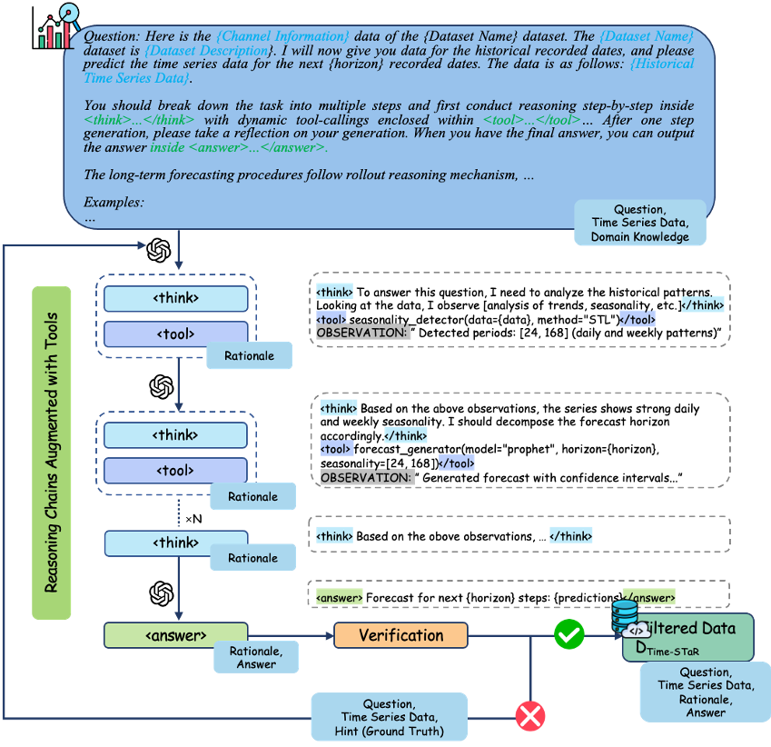
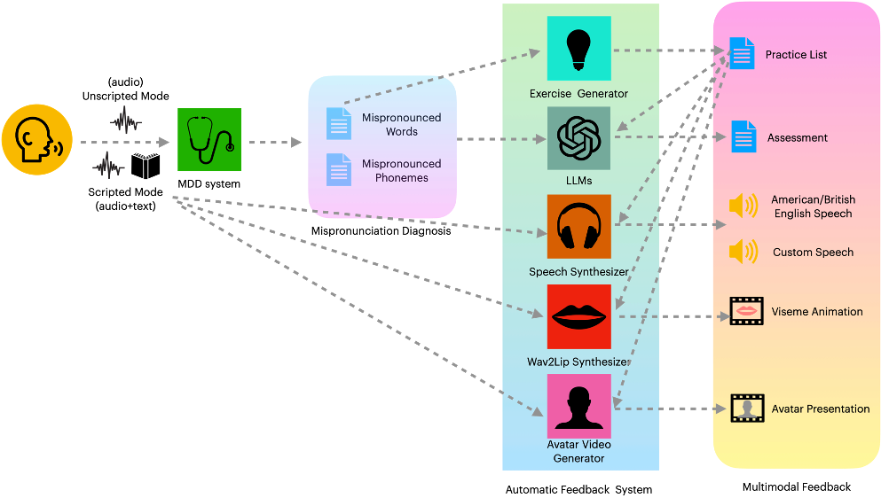
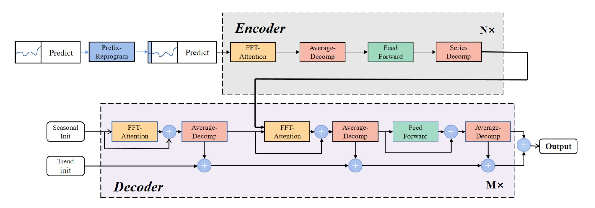
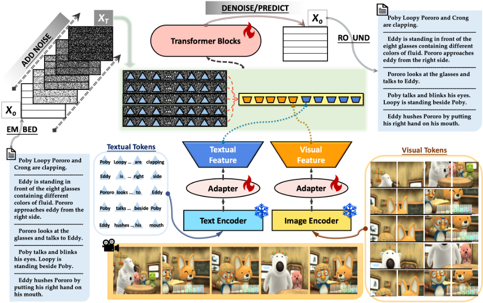
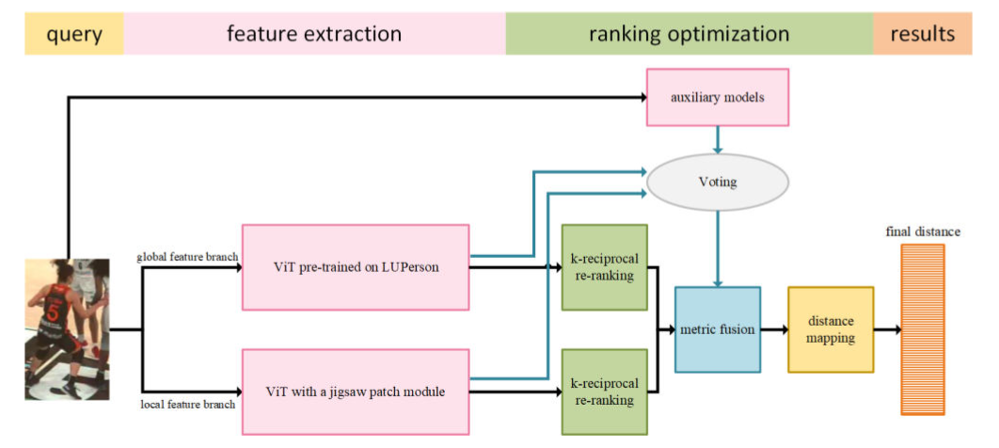

## Publications

---

  

    
    
ICML 2026

  

  

    <h3>ST-VAD: Spatial-Temporal Mental Modeling for Industrial Video Anomaly Detection via Object-Centric Reasoning</h3>
    
<strong>Mei Yuan</strong>, Yang Liu, Min Xu

    
Submitted to ICML 2026

    

      <a href="#" class="pub-link">📄 Paper</a>
      <a href="#" class="pub-link">📊 Project</a>
    

    

      

        TL;DR:
        A VLM-based reasoning framework that elevates video anomaly detection from pattern matching to cognitive-level understanding. By simulating human spatial perception and representing scene dynamics via object-centric state graphs, our approach achieves state-of-the-art performance on industrial benchmarks, pioneering explainable anomaly detection for robotic laboratories.
      

    

  

---

  

    
    
ICML 2026

  

  

    <h3>Time-STaR: Self-Taught Reasoners Augmented with Tools for Reliable Time Series Analysis</h3>
    
Submitted to ICML 2026

    

      <a href="#" class="pub-link">📄 Paper</a>
      <a href="#" class="pub-link">💻 Code</a>
    

    

      

        TL;DR:
        A reasoning-centric framework that repurposes LLMs for time series forecasting. By curating the Time-STaR-CoTT dataset and implementing GRPO-style reinforcement learning, we enable models to identify causal relationships, detect regime changes, and generate interpretable forecasts—achieving state-of-the-art results across weather, traffic, and finance domains.
      

    

  

---

  

    
    
CHI 2026

  

  

    <h3>Guiding Grasp and Growth: Multi-Modal Detection and Feedback on Accented Mispronunciation</h3>
    
<strong>Mei Yuan</strong>, Boting Li

    
Submitted to CHI 2026

    

      <a href="https://drive.google.com/file/d/1Cld1n7yeURCJH_tsa8Z_pG_sF3j9kN73/view?usp=drive_link" class="pub-link">📄 Paper</a>
      <a href="#" class="pub-link">🎯 Demo</a>
    

    

      

        TL;DR:
        An interactive text-vision-audio pronunciation coaching system combining LLM-powered assessment, Neural TTS exemplars, and viseme animations. Validated with 82 students showing 90%+ satisfaction, the system was adopted as an intelligent teaching assistant in a graduate-level English course at Peking University.
      

    

  

---

  

    
    
IJCNN 2026

  

  

    <h3>PRformer: Prefix Reprogramming Transformers for Long-Term Series Forecasting</h3>
    
<strong>Mei Yuan</strong>, Hongcheng Guo

    
Submitted to IJCNN 2026

    

      <a href="#" class="pub-link">📄 Paper</a>
      <a href="#" class="pub-link">💻 Code</a>
    

    

      

        TL;DR:
        A novel approach for long-term time-series forecasting through Prefix Reprogramming with noise-based prefixes, FFT-Attention for periodic patterns, and Average Decomposition for seasonal-trend separation—avoiding information bottlenecks common in traditional Transformer architectures.
      

    

  

---

  

    
    
EMNLP 2023

  

  

    <h3>DiffuVST: Narrating Fictional Scenes with Global-History-Guided Denoising Models</h3>
    
Shengguang Wu, <strong>Mei Yuan</strong>, Qi Su

    
Findings of EMNLP 2023

    

      <a href="https://arxiv.org/pdf/2312.07066v1" class="pub-link">📄 Paper</a>
      <a href="#" class="pub-link">🌐 Project</a>
    

    

      

        TL;DR:
        A non-autoregressive DiffusionLM-based storytelling model that generates coherent narratives around visual sequences. Trained with weighted conditions on global vision-language history, DiffuVST achieves superior performance with 10× faster inference than autoregressive models.
      

    

  

---

  

    
    
ACM MM 2022

  

  

    <h3>A Person Re-identification Approach Focusing on the Occlusion Problem and Ranking Optimization</h3>
    
Wenkai Zheng, <strong>Mei Yuan</strong>

    
ACM Multimedia 2022 (MMSports Workshop)

    

      <a href="https://dl.acm.org/doi/abs/10.1145/3552437.3555692" class="pub-link">📄 Paper</a>
      <a href="#" class="pub-link">🏆 2nd Place</a>
    

    

      

        TL;DR:
        A robust person re-identification method addressing occlusion challenges through dual-branch Vision Transformer with jigsaw patch modules and innovative ranking optimization. Achieved 98.38% mAP and 99.57% rank-1 accuracy, winning second place in the DeepSportRadar Player REID Challenge.
      

    

  

---

### Also see [Google Scholar](https://scholar.google.com/citations?user=q4kZ8WMAAAAJ&hl=en) for the complete list.